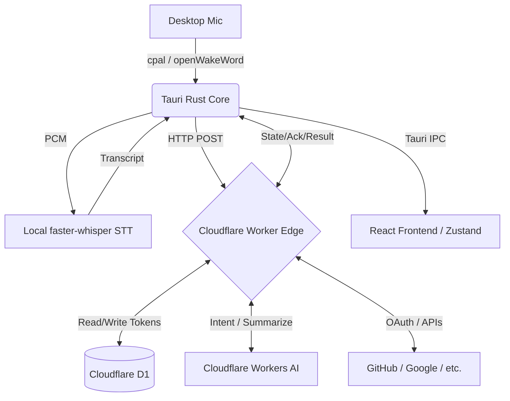

# NEXUS — Edge-Driven Desktop AI Assistant

A cross-platform, Siri-like floating overlay assistant. NEXUS employs a **thin-client architecture** where the desktop app (Tauri v2 + Rust + React/TS) manages local hardware (wake-word, VAD, local STT, system automation), while all heavy reasoning, LLM processing, and OAuth authentication run securely on a **Serverless Edge** (Cloudflare Workers + D1).

## System Architecture

NEXUS has transitioned to a fully serverless backend. No sidecars, no Docker, and no local Ollama required for core reasoning.



### 1. Desktop Thin Client (Rust & Tauri v2)
* **Wake Word**: Offline, low-power (~0.5% CPU) `openWakeWord` inference using `tract-onnx` (pure Rust, no C++ deps). Uses AGC (Automatic Gain Control) and silence gating (RMS < 0.0005) to prevent false triggers.
* **Command Classifiers (Tier 3)**: Lightweight ONNX models bypass STT for known commands (e.g., `open`, `close`, `search`, `play`).
* **VAD (Voice Activity Detection)**: Ends utterances automatically and streams audio.
* **App Registry**: A pre-indexed, Raycast/Alfred-style disk cache with fuzzy matching for instantaneous `O(1)` app launching without slow shell commands.
* **UI Windows**: Frameless, region-aware click-through overlay. Uses native window blurring (Acrylic on Windows, Vibrancy on macOS).

### 2. Privacy-First Local STT
* Transcriptions are handled **locally** by a Python `faster-whisper` server on port `39217`.
* Voice audio never leaves your machine. Only the resulting text transcript is POSTed to the Cloudflare Worker.

### 3. Serverless Edge (Cloudflare Workers & AI)
* **Stateless API**: Receives transcripts, classifies intent, fetches external data, and returns actions/text. Cold starts in <5ms.
* **Workers AI**: Uses free-tier Edge AI models.
  * *Intent Classification*: Llama 3.2 1B (`@cf/meta/llama-3.2-1b-instruct`)
  * *Summarization*: Mistral 3.1 24B (`@cf/mistral/mistral-small-3.1-24b-instruct`)
  * *Deep PR Analysis*: GLM-4.7-Flash / GLM-5.3-Flash (for complex 1M+ token context GitHub PR analysis).

## Authentication & API Keys

NEXUS handles secrets using a highly secure, decentralized approach:
1. **No Local Secrets**: The desktop app never stores 3rd-party API keys or OAuth secrets.
2. **Device Identity**: Upon installation, the client generates a local `user_id` and `device_id` (UUIDv4) stored in `%APPDATA%\com.nexus.assistant\nexus-config.json`.
3. **Cloudflare D1**: OAuth tokens (Google, GitHub) and user-supplied API keys are encrypted at the edge (via Fernet / `NEXUS_ENCRYPTION_KEY`) and stored in Cloudflare's D1 SQLite database.
4. **OAuth Flow**: Triggered from the client (`nexus://oauth/callback` deep link), handled entirely by the Cloudflare Worker.

## Languages, Frameworks, & Packages

### Backend (Rust / Tauri)
* **Tauri v2**: Core IPC and window management.
* **cpal**: Raw 16kHz mono audio capture.
* **tract-onnx**: Pure Rust ONNX execution for `openWakeWord` models (`melspectrogram`, `embedding`, `nexus` classifier).
* **reqwest**: HTTP client for edge communication.
* **window-vibrancy**: Native UI blurring.
* **sysinfo / winreg**: Application discovery and process management.

### Frontend (TypeScript / React)
* **React 18 & Vite**: Fast UI rendering and dev server bundling.
* **Zustand**: Strict state machine (`idle` -> `listening` -> `thinking` -> `speaking` -> `idle`).
* **framer-motion / lottie-web**: Advanced SVG and UI state animations (e.g., the glowing NEXUS orb).
* **@ricky0123/vad-web**: Browser-side VAD fallback.

### Edge Worker (TypeScript)
* **Cloudflare Workers**: Edge compute.
* **Cloudflare D1**: SQL storage for configuration.

## Developer Quick Start

### 1. Build the Frontend
```powershell
npm --prefix frontend install
npm --prefix frontend run build
```

### 2. Run the Rust Backend
If running locally without building an installer, you **must** pass the `custom-protocol` feature so Tauri correctly loads the Vite assets instead of failing on `localhost refused to connect`.

```powershell
cd src-tauri
$env:NEXUS_SERVER_URL = "https://nexus-worker.your-subdomain.workers.dev"
cargo run --release --features custom-protocol
```

*Note: For CI or testing without native audio dependencies, you can compile with `--features mock-wake` to trigger the assistant via hotkey only.*

### 3. Deploy the Edge Worker
```bash
cd server/worker
npx wrangler d1 create nexus-db
npx wrangler d1 execute nexus-db --file=schema.sql --remote
npx wrangler secret put NEXUS_ENCRYPTION_KEY
npx wrangler deploy
```
Update `$env:NEXUS_SERVER_URL` in your build environment before compiling the desktop app to point to your new worker.

## Production Build (Installer)

Always build the desktop app installer with the Tauri CLI via the build script:

```powershell
$env:NEXUS_SERVER_URL = "https://nexus-worker.your-subdomain.workers.dev"
pwsh ./scripts/build.ps1 -Release
```
Set signing env vars (see `scripts/build.ps1` and `.github/workflows/release.yml`).

## Configuration Points
- **Worker URL:** Baked into the binary at compile time via the `NEXUS_SERVER_URL` environment variable.
- **Wake Word (openWakeWord):** The wake word engine uses openWakeWord (`wakeword-oww` feature by default) and its assets are bundled in `src-tauri/resources/oww/`.
- **Serverless Backend:** NEXUS is fully serverless. The backend logic runs on Cloudflare Workers (intent classification, summarization via Workers AI, and D1 for storage). No local sidecar or n8n is needed.

## Platforms
| OS | Notes |
|---|---|
| Windows 10/11 | Primary target. NSIS installer; WebView2 bootstrapper. Skip-taskbar overlay. |
| macOS (AS + Intel) | Universal `.dmg`, notarized; `LSUIElement=true` hides dock. |
| Linux (X11/Wayland) | AppImage + `.deb`; compositor required for true transparency. |

## License
Proprietary — © 2026 NEXUS.
